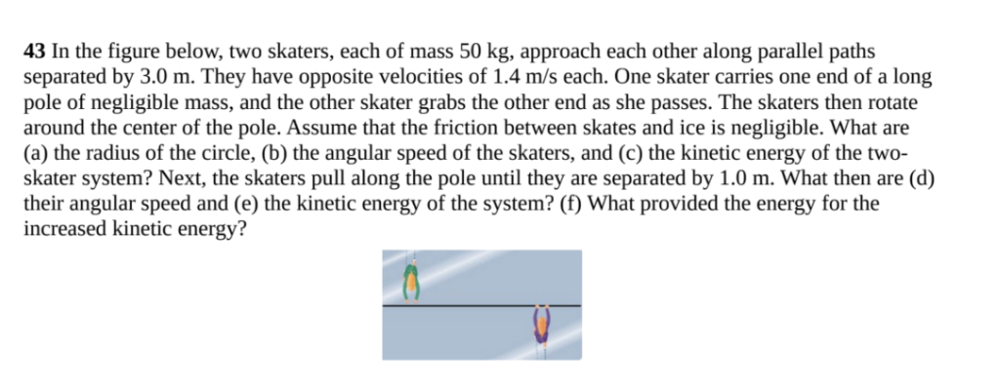

# physicsFinal

We are recreating a problem on conservation of angular momentum from the first semester. In the simulation, two skaters on frictionless ice move along opposite parallel paths, when they hit and grab onto a pole and rotate. It will show how the angular momentum of the system is conserved while the kinetic energy is not since the collision is inelastic.

We will be allowing the user to control the skaters' respective masses and initial velocities, as well as the pole which will have a significant moment of inertia. The user can also pick where the skaters collide with the pole. We are also considering adding friction to slow the system to a stop.

We will graph or display the kinetic energy of the system, the skaters' angular velocities/momenta, and the linear velocity after impact.

